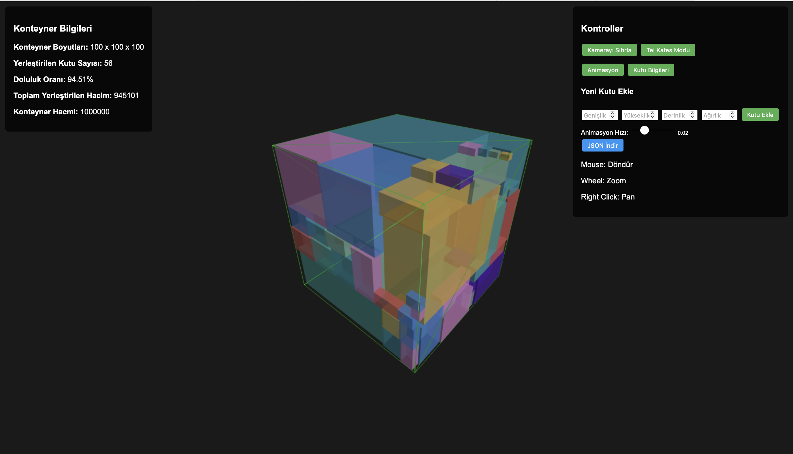

## BoxML

3B kutu yerleştirme (bin packing) optimizasyonu. ML.NET ile regresyon tabanlı konum tahmini ve Python tarafında Q-learning ile pekiştirmeli öğrenme denemeleri; sonuçların JSON olarak yazılması ve basit HTML/CSS ile görselleştirme.

### Kullanılan Teknolojiler ve Araçlar
- **Diller**: C# (.NET), Python
- **Çatı/SDK**: .NET 9.0 (SDK 9.x)
- **ML (C#)**: ML.NET (Microsoft.ML), FastTree regresyon
- **RL (Python)**: Q-learning ajanı (ızgara arama + rotasyon denemeleri)
- **Veri/IO**: JSON okuma/yazma (`System.Text.Json`, `Newtonsoft.Json`), `project/placement_result.json`, `rl_placement_result.json`
- **Görselleştirme**: Basit HTML/CSS (`project/index.html`, `project/visualization.html`, `project/style.css`)
- **Paket Yönetimi**: NuGet
- **Araçlar**: Git/GitHub, Cursor/VS Code

### .NET Bağımlılıkları (Sürümler)
- **Microsoft.ML**: 4.0.2
- **Microsoft.ML.FastTree**: 4.0.2
- **Newtonsoft.Json**: 13.0.3
- **System.CodeDom**: 8.0.0
- **System.Collections.Immutable**: 8.0.0
- **System.Memory**: 4.6.0
- **System.Numerics.Tensors**: 8.0.0
- **System.Reflection.Emit.Lightweight**: 4.7.0
- **System.Threading.Channels**: 8.0.0

### Proje Yapısı (özet)
- **C# Uygulaması**: `Program.cs` — ML.NET ile eğitim ve yerleştirme, çıktı JSON
- **RL Deneyleri (Python)**: `rl_python/rl_box_packing.py` — Q-learning ile yerleştirme denemeleri
- **Veri**: `data.json`, `project/placement_result.json`, `project/rl_placement_result.json`
- **Görsel**: `project/index.html`, `project/visualization.html`, `project/style.css`

### Proje Çalıştırma ve Sonuçlar

Proje başarıyla çalıştırıldı ve aşağıdaki sonuçlar elde edildi:

**Sonuç Özeti:**
- **Toplam Kutu**: 141 kutu işlendi
- **Yerleştirilen**: 55 kutu başarıyla yerleştirildi
- **Doluluk Oranı**: %94.49
- **Toplam Hacim**: 944,909 birim³
- **ML Tahmin**: Yeni kutular için pozisyon tahmini çalışıyor
- **Rotasyon Optimizasyonu**: 6 farklı rotasyon ile en iyi yerleştirme

### Kısa Özet (CV için)
- **Alan**: 3B kutu yerleştirme/optimizasyon, ML ve RL hibrit yaklaşımı
- **ML**: ML.NET FastTree ile posX/posY/posZ regresyon modelleri, rotasyon+skorlama ile en iyi yerleştirme
- **RL**: Python Q-learning ajanı; ızgara tabanlı eylem uzayı, ödül fonksiyonu ile doluluk/kenar hizalama odaklı optimizasyon
- **Sonuç**: JSON çıktılar ve HTML/CSS ile hızlı gözlem; .NET 9 üzerinde çalışır, NuGet bağımlılıkları listelenmiştir

